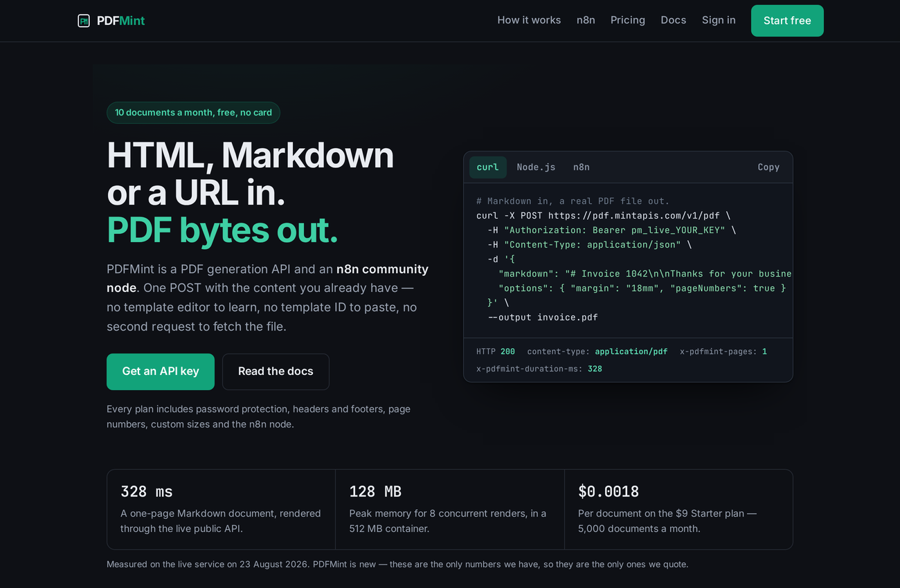
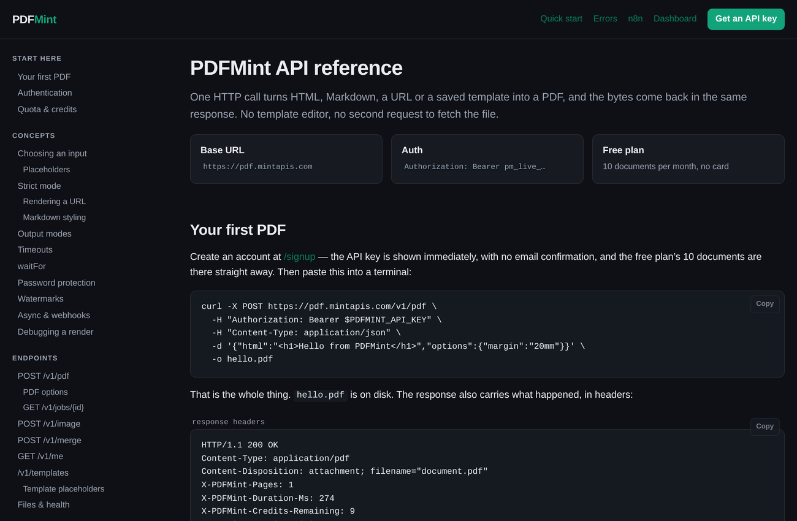

# PDFMint

**POST HTML, Markdown or a URL. Get the PDF bytes back in the same response.**

No template editor to learn, no template ID to paste, no second request to fetch the
file, and no headless Chrome of your own to run. There is a hosted service at
**[pdf.mintapis.com](https://pdf.mintapis.com)** — 10 documents a month free, no card —
and an [n8n community node](https://github.com/fstandhartinger/n8n-nodes-pdfmint) that
returns the file on the node itself.

This repository is the API behind both.

```bash
curl -X POST https://pdf.mintapis.com/v1/pdf \
  -H "Authorization: Bearer pm_live_YOUR_KEY" \
  -H "Content-Type: application/json" \
  -d '{
    "markdown": "# Invoice 1042\n\nThanks for your business.",
    "options": { "margin": "18mm", "pageNumbers": true }
  }' \
  --output invoice.pdf
```

`200`, `content-type: application/pdf`, and the file on disk. The response also carries
`x-pdfmint-pages` and `x-pdfmint-duration-ms`, so a workflow can act on the result
without parsing the document.



## What it does

| Endpoint | What it is for |
| --- | --- |
| `POST /v1/pdf` | HTML, Markdown, a URL or a saved template → PDF |
| `POST /v1/image` | The same input → PNG or JPEG |
| `POST /v1/merge` | Several PDFs, by URL or base64 → one PDF |
| `GET/POST /v1/templates` | Named templates with `{{placeholders}}` |
| `POST /v1/jobs` | The same renders, asynchronously, with a webhook |
| `GET /v1/me` | Plan, credits used, credits left |

Options that exist because their absence is what makes generated PDFs look generated:
page numbers that are not clipped by the margin, repeating table headers, headers and
footers, page size and orientation, background printing, password protection, and a
strict mode that **refuses to render a template with a missing placeholder** rather
than silently shipping a document with a hole in it.

The full reference, with runnable curl, Node.js, Python and n8n examples, is at
[pdf.mintapis.com/docs](https://pdf.mintapis.com/docs).



## Measured, not estimated

Numbers quoted on the site are checked against this code by
`test/documented-limits.test.js`, which fails the build when a page and the code
disagree. On the live service, on 23 August 2026:

- **328 ms** for a one-page Markdown document, through the public API.
- **128 MB** peak for eight concurrent renders in a 512 MB container.
- **$7.00/month** to run the whole thing — one Render Starter instance and a free-tier
  Postgres. `ops/INFRASTRUCTURE.md` lists every resource it created and
  `ops/reap.sh --destroy` removes them.

PDFMint is new. Those are the only numbers there are, so they are the only ones quoted.

## Plans

| Plan | Documents / month | Price |
| --- | ---: | ---: |
| Free | 10 | $0 |
| Starter | 5,000 | $9 |
| Pro | 50,000 | $29 |
| Scale | 250,000 | $99 |

## Running it yourself

It is a plain Express app and a Postgres database. Playwright renders the pages;
`pdf-lib` does the page-number and merge work.

```bash
npm install
cp .env.example .env.local     # DATABASE_URL and SESSION_SECRET are the only ones needed
npm run migrate
npm start                      # http://localhost:3000
npm test                       # needs a database; Stripe tests skip without keys
```

Stripe is optional — without keys the billing routes are inert and every account stays
on the free plan.

## Related

- Ready-made workflows: [Generate PDF invoices from webhook data](https://n8n.io/workflows/18734-generate-pdf-invoices-from-webhook-data-with-pdfmint)
  and [Send branded PDF receipts for Stripe payments](https://n8n.io/workflows/18793) —
  two published n8n templates built on this API, openable and importable from inside n8n.
- [n8n-nodes-pdfmint](https://github.com/fstandhartinger/n8n-nodes-pdfmint) — the n8n
  community node, verified by n8n, zero runtime dependencies.
- [DocMint](https://github.com/fstandhartinger/docmint) — the same idea for Word, Excel
  and PowerPoint templates.

## License and status

Run by one person. Issues and pull requests are read. If something in the docs is wrong
or a PDF comes out wrong, an issue with the request id from the `X-Request-Id` header
is enough to find it in the logs.
